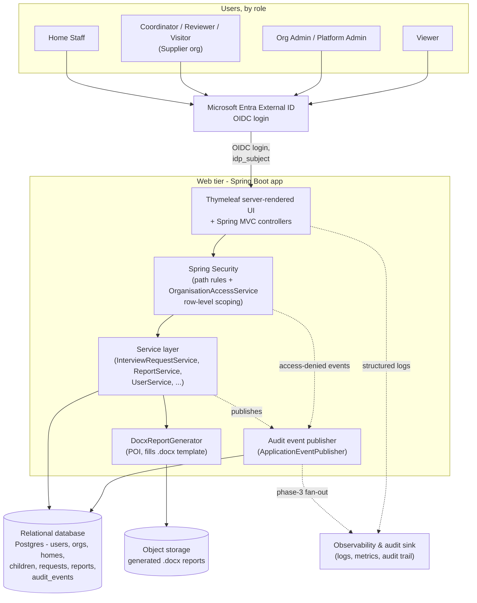
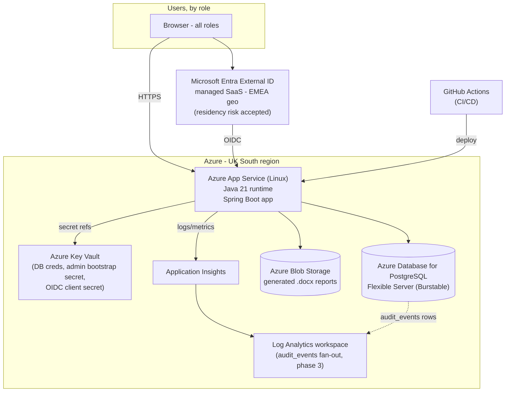

# High-Level Architecture (Azure)

- **Status:** Proposed — high-level only, no IaC/Bicep/Terraform, nothing provisioned.
- **Date:** 2026-08-29
- **Builds on:** T4 (security/observability), `AUTH-PROVIDER-OPTIONS.md` (T6/T14 — cloud =
  Azure, confirmed), `AUDIT-PLAN.md` (T10/T13 — retention & storage decided).
- **Cloud decision:** the human has chosen **Microsoft Azure** — this settles the AWS/Cognito
  comparison as moot (Cognito was only in play as a same-cloud option for an AWS deployment).
- **Identity decision:** **Microsoft Entra External ID** (managed SaaS). Its tenant residency is
  EMEA-geo (UK + EU), not a strict UK-only pin — **the human has explicitly accepted that
  residency risk** in exchange for £0 cost and zero ops burden. Application data stays in UK
  South regardless. See §2a and the Accepted-risk note in `AUTH-PROVIDER-OPTIONS.md` §5.

## 1. High-level logical architecture

This is the application view — no vendor names yet, just the shape of the system as it
exists in code today (`SecurityConfig`, Thymeleaf templates, `DocxReportGenerator`,
`ReportService`) plus the two enhancements already planned (external IdP login, `audit_events`).

Nothing here is new architecture for its own sake: the web/service split, `Postgres`, and
`.docx` generation already exist; the diagram adds only the two agreed changes (an external
IdP in front of login, and the audit publisher sitting alongside the existing service layer)
plus moving generated `.docx` files out of local disk into durable object storage — local
disk on a PaaS web tier isn't durable across restarts/scale-out, so this was implicit in
"deploy to a cloud PaaS" even before this doc.

## 2. Azure services mapping

Same shape, each box mapped to a concrete Azure service. All services below have a UK South
region option — call this out explicitly since data residency here is **UK-only, hard**
(per `AUTH-PROVIDER-OPTIONS.md`).

| Logical component | Azure service | Rationale |
|---|---|---|
| Compute (web tier) | **Azure App Service (Linux, Java 21)** | Matches the app's runtime exactly (`pom.xml`: Java 21, Spring Boot 4.1.0, packaged as a jar); PaaS with built-in TLS, scaling, and deployment slots — no container/K8s work needed for a single Spring app at this scale. Container Apps is the fallback if the team later wants container-native deploys, but App Service is simpler for what's here today. |
| Identity | **Microsoft Entra External ID (EMEA geo — residency risk accepted)** | Managed SaaS, so it sits outside the UK South resource group rather than in it. Free to 50k MAU, MFA included, native fit for Azure, zero ops burden. **Residency caveat:** its tenant residency is EMEA-geo (UK + EU), not a strict UK-only pin — explicitly accepted by the human; self-hosted Keycloak in UK South remains the documented fallback if that requirement ever hardens. |
| Secrets | **Azure Key Vault** | Directly fixes the T4 finding that DB credentials and the admin bootstrap password are committed in plaintext to `application.properties` — App Service reads them as Key Vault references instead. |
| Database | **Azure Database for PostgreSQL Flexible Server (Burstable, B1ms)** | The app already targets Postgres via Flyway (`flyway-database-postgresql`) with zero code change needed; Burstable is the right tier for a low, spiky load at 20 users. |
| Generated report storage | **Azure Blob Storage** | Replaces the current local-disk `app.docx.output-dir` — durable, survives app restarts/scale-out, and is the natural home for a "High" PII-sensitivity artifact per `AUDIT-PLAN.md` (access can be logged/audited independently of the app). |
| Observability | **Application Insights + Log Analytics** | Directly delivers the T4 observability gap (zero Actuator/structured logging today) and is the phase-3 log fan-out target already earmarked in `AUDIT-PLAN.md` for `audit_events`. |
| Ingress/TLS | **App Service's built-in TLS/custom domain** | Sufficient at this scale — a single-region, single-instance app for ~20 users doesn't need Front Door/App Gateway's WAF/multi-region routing; revisit only if the org grows to multiple regions or needs a WAF for compliance reasons. |
| CI/CD | **GitHub Actions** | Matches the T4 finding that there's no CI today despite a real test suite (JUnit + Testcontainers + Playwright already in `pom.xml`) — GitHub Actions is the lowest-friction way to run `mvn test` and deploy to App Service; Azure DevOps is an equally valid alternative if the org already standardizes on it. |

**On Cognito:** not selected — it was only ever relevant had the deployment target been AWS. The
Entra-vs-Cognito addendum in `AUTH-PROVIDER-OPTIONS.md` is moot on that half, though its
residency analysis is exactly what the accepted risk in §2a rests on.

### 2a. Identity — Entra External ID, residency risk accepted (decided)

**Decided 2026-08-29:** identity is **Microsoft Entra External ID**, a managed SaaS IdP. It is
deliberately drawn *outside* the UK South box above — it is not a UK South resource.

*Why:* £0 at this scale (free to 50,000 MAU), MFA included, first-class OIDC, native fit for
Azure, and zero self-hosting burden for a team with no existing IdP-ops function.

> **⚠️ Accepted risk — identity-data residency.** Entra External ID's tenant residency resolves
> to an **EMEA geo (UK *and* EU datacenters)**, not a strict UK-only pin. Identity data — names,
> emails, authentication logs — may rest in EU as well as UK datacenters. **The human explicitly
> accepted this on 2026-08-29**, choosing managed Entra's low cost and ops burden over
> self-hosted Keycloak's standing operational cost.
>
> **This does not affect application data.** Children's records, interview requests, reports,
> `audit_events` and generated .docx files all stay in Azure UK South, per the diagram above.
>
> **Revisit trigger:** if a commissioner, DPA or contract later mandates strict UK-only identity
> residency — or Microsoft ships a UK-specific option for External ID — fall back to
> **self-hosted Keycloak on Azure UK South** (~£10–£15/mo compute, plus ops burden), which stays
> documented in `AUTH-PROVIDER-OPTIONS.md` §2 for that purpose.

*Unchanged by this decision:* the thin-claims design, `idp_subject` linking, and the 5-phase
strangler migration in `AUTH-PROVIDER-OPTIONS.md` are provider-agnostic — which is exactly why
falling back to Keycloak later would mean standing up the instance and repointing the OIDC
client, not redesigning authorization.

## 3. Cost estimate — 20 users

Approximate **UK South, pay-as-you-go list prices**, in GBP (converted from published USD
list rates where a direct GBP figure wasn't available) — treat as a planning-level estimate,
not a quote; confirm against the Azure Pricing Calculator before committing a budget.

| Service | SKU / tier | Monthly est. (GBP) | Assumptions |
|---|---|---|---|
| Azure App Service | Linux, **B1** (1 core, 1.75 GB) | ~£10 | Single instance, no auto-scale — 20 users generates negligible sustained load; upgrade to B2/S1 only if response times degrade |
| Azure Database for PostgreSQL Flexible Server | Burstable **B1ms** (1 vCore, 2 GiB) + ~32 GB storage | ~£13 | Compute ~£10 + storage/backup ~£3; Burstable is right-sized for spiky, low-volume traffic |
| Azure Blob Storage | Hot tier, LRS, a few GB of `.docx` files | <£1 | Generated reports are small Word documents; volume at 20 users is trivial |
| Azure Key Vault | Standard tier | <£1 | Secret storage + low operation count (app reads a handful of secrets at startup/refresh) |
| Application Insights + Log Analytics | Pay-as-you-go, low ingest | £0–£3 | Likely within (or just over) the free ~5 GB/month ingestion allowance at this user count |
| Identity — **Entra External ID** (managed, §2a) | Free tier | **£0** | Free to 50,000 MAU; 20 users is nowhere near it. No compute to run — the self-hosted Keycloak alternative would have added ~£10–£15/mo plus ops burden |
| GitHub Actions | Free tier | £0 | Free minutes allowance comfortably covers CI for a project this size |
| **Total** | | **~£25–£30/month** | Line items sum to ~£24–£28; rounded to a planning range. Excludes one-off setup time, egress and any support-plan costs |

**Note on the identity line:** choosing managed Entra over self-hosted Keycloak removes both the
~£10–£15/mo of Keycloak compute *and* — the larger saving — the patching, upgrade and backup ops
burden that no £ figure captures. That saving is what the accepted residency risk buys (§2a); if
that risk ever has to be reversed, budget the Keycloak line back in and the total returns to
roughly £35–£45/mo.

**What scales first if usage grows:** App Service compute (B1 → B2/S1 as concurrent users or
docx-generation load rises) and PostgreSQL compute (Burstable → General Purpose once
sustained, non-bursty load appears) are the two dials to turn before anything else in this
list becomes a bottleneck — Blob, Key Vault, identity and CI costs stay near-flat well past
20 users.

---

## Alternative: DigitalOcean (cost comparison)

Evaluated 2026-08-30 at god's request. **The Azure design above stands** — this section is a
decision aid, not a replacement. Entra External ID is unaffected either way: it is
provider-agnostic SaaS and works from any host, so the accepted residency risk in §2a is
unchanged by this comparison.

### Stack mapping

| Component | Azure (designed) | DigitalOcean equivalent | Delta |
|---|---|---|---|
| Compute | App Service Linux B1 | **App Platform** (or a Droplet) running the Java 21 jar | Comparable PaaS; App Platform is the like-for-like |
| Database | PostgreSQL Flexible Server B1ms | **The team's existing DO SQL database** — *if* it is PostgreSQL | **The pivotal assumption — see below** |
| Report storage | Blob Storage | **Spaces** (S3-compatible) | Fine functionally; needs an S3 client instead of the Azure SDK |
| Secrets | **Key Vault** | App Platform encrypted env vars | **Downgrade** — no managed rotation, versioning, or access auditing |
| Observability | App Insights + Log Analytics | DO's built-in metrics only | **Downgrade** — no APM/log-analytics equivalent |
| Ingress/TLS | App Service built-in | App Platform built-in | Equivalent |
| CI/CD | GitHub Actions | GitHub Actions | Unchanged |
| Identity | Entra External ID | Entra External ID | Unchanged, £0 |
| Residency | UK South | **LON1 (London)** — keeps app data in the UK | Equivalent for app data |

### Cost — 20 users, side by side

Approximate list prices; DO prices are USD converted at roughly £0.79/$1 and rounded.

| Line | Azure | DO (reusing existing DB) | DO (new managed DB) |
|---|---|---|---|
| Compute | ~£10 | ~£9.50 (App Platform ~$12) | ~£9.50 |
| Database | ~£13 | **£0 incremental** (assumed spare capacity) | ~£12 (managed PG from ~$15.15) |
| Report storage | <£1 | ~£4 (**Spaces is a flat $5 floor** — 250 GiB minimum billing; Azure Blob is cheaper at our trivial volume) | ~£4 |
| Secrets | <£1 | £0 (env vars) | £0 |
| Observability | £0–£3 | £0 built-in (but see gap below) | £0 |
| Identity (Entra) | £0 | £0 | £0 |
| CI/CD | £0 | £0 | £0 |
| **Total** | **~£25–£30** | **~£14** | **~£26** |
| **Saving vs Azure** | — | **~£11–£16/mo (~£130–£190/yr)** | **~£0 — a wash** |

Two things the table makes obvious:
- **The entire saving is the database line.** Remove the existing-DB assumption and DigitalOcean
  costs about the same as Azure. There is no general "DO is cheaper" effect here at this scale.
- **Spaces is *more* expensive than Blob for us** (~£4 vs <£1), because its $5/250 GiB floor is
  billed whether we store 250 GiB or 200 MB of .docx files. That erodes ~£3/mo of the saving.

### The pivotal assumption: is the existing DB PostgreSQL?

**The app is PostgreSQL-only, and not superficially so.** Verified in the code:
- `pom.xml` pulls `flyway-database-postgresql`, the `postgresql` JDBC driver, and
  `testcontainers-postgresql` (so the test suite pins Postgres too);
- the migrations use `BIGSERIAL` (6 occurrences across V1/V5), `now()` defaults, and `TEXT`
  columns throughout;
- `V8__multi_role_users_and_visitor_rename.sql` uses `ALTER INDEX ... RENAME TO`, which MySQL
  does not have;
- `AUDIT-PLAN.md` §B.4 further plans a Postgres rule/trigger for append-only `audit_events`.

**If the existing DO database is MySQL, the saving is not real** — porting 10 migrations, the
JPA/Hibernate dialect, the test suite's Testcontainers setup, and the planned audit-immutability
mechanism is easily a multi-week job. That cost dwarfs ~£150/yr and would have to be paid before
any saving begins.

**Even if it is PostgreSQL**, reusing a database another application already depends on is worth
a moment's thought for this system specifically: it co-locates children's social-care data with
whatever else lives there, shares a blast radius for restores and upgrades, and makes the
"noisy neighbour" failure mode a safeguarding-system outage. Not disqualifying — but it is a
different risk posture from a dedicated instance, and the £13/mo it saves is not much of a
premium to avoid it.

### Short-term recommendation: **no — do not switch now**

Decisively, on four grounds:

1. **The saving is small in absolute terms.** ~£11–£16/mo (~£130–£190/yr) at the *best case*,
   and £0 if the existing DB turns out not to be Postgres or not to have spare capacity. That is
   not a number that should redirect an architecture.
2. **The one-off switching cost is larger than the annual saving.** Re-doing the deployment
   design, swapping the Azure Blob SDK for an S3 client, rebuilding CI deployment, and re-testing
   against a shared database is comfortably a week or more of work — before counting the branches
   already in flight against the Azure plan.
3. **It regresses two things we deliberately decided.** Key Vault was chosen specifically to fix
   the committed-credentials finding (T4); App Platform env vars do fix that too, but without
   rotation, versioning or access auditing. More significantly, DO has no App Insights/Log
   Analytics equivalent, and enhancement 3.2's phase-3 audit fan-out (`AUDIT-PLAN.md` §B.1)
   assumes one — on DO that means adopting a third-party sink, adding back cost and a vendor.
4. **Nothing is urgent.** No capacity problem, no Azure commitment signed, no deadline forcing
   the call. The cheap option is to keep building on the Azure design and revisit if the hosting
   bill ever becomes material — which at ~£25–30/mo it is not.

**When this answer would change:** if the team's DO database is confirmed PostgreSQL *with* real
spare capacity **and** the team already operates DigitalOcean day-to-day (so the Azure path means
learning a second cloud), then the operational-familiarity argument becomes stronger than the
£150/yr and this is worth reopening — before, not after, the Azure deployment work lands.

### Confirmations needed from the human

1. **Is the existing DigitalOcean database PostgreSQL (not MySQL), and is it genuinely spare
   capacity that is already paid for?** This single answer decides whether the saving is ~£150/yr
   or £0 — and if it is MySQL, the porting cost makes DigitalOcean the *more* expensive option.
2. **Does the team already run day-to-day on DigitalOcean rather than Azure?** If so, operational
   familiarity may matter more than the cost delta, which would justify reopening this despite
   the recommendation above.
