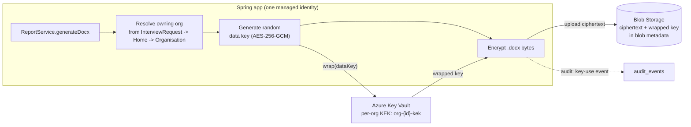
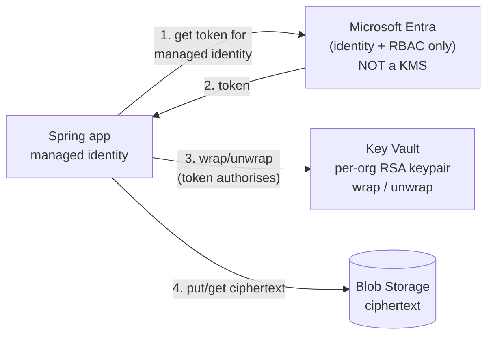

# Design exploration: encrypting persisted report .docx files

- **Status:** Design exploration / feasibility read. **No implementation, no infra.**
- **Date:** 2026-08-30
- **Context:** `ARCHITECTURE.md` (Azure, Blob Storage for generated reports), `AUTH-PROVIDER-OPTIONS.md`
  (Entra External ID, residency risk accepted), `AUDIT-PLAN.md` (audit trail).

## 0. Where we are today

Grounded in the code, not the plan:

- `ReportService.generateDocx()` writes to **local disk** — `Path.of(appProperties.getDocx().getOutputDir(), filename)`,
  filename `rhi-report-{requestId}-{millis}.docx` — and stores the bare filename in
  `report.generatedDocumentPath`.
- `ReportController.download()` serves it with `FileSystemResource`, gated by
  `interviewRequestService.getAuthorized(requestId, principal)` and an APPROVED-status check.
- **There is no encryption anywhere today**, and the file is only as protected as the host's
  filesystem. `ARCHITECTURE.md` moves this to Azure Blob; this document is about what to do at
  that migration.
- Access control is **entirely application-layer**: `OrganisationAccessService` +
  `InterviewRequestService.getAuthorized`. Organisations are **rows in our database**, not Entra
  tenants or identities. The app runs as **one service principal**.

Two incidental notes worth carrying into implementation: the blob key should not embed the
child's name (today's server-generated filename correctly doesn't — keep it that way), and
`ReportController` putting the child's full name in the `Content-Disposition` header is fine for
a browser download but must not become the storage key.

## 1. Threat model first

Azure Blob already applies **service-side encryption (SSE) at rest by default** with
Microsoft-managed keys. So the honest question is: *what does per-org encryption buy on top of
that?* Being precise here is what keeps the design proportionate.

| # | Threat | Does today's plan (private container + SSE + app authz) cover it? | Does per-org app-side encryption help? |
|---|---|---|---|
| T1 | **Storage-account compromise** — leaked account key/SAS, misconfigured public container, stolen backup | ❌ SSE is transparent to anyone holding storage credentials | ✅ **Yes — the primary win.** Attacker gets ciphertext; keys live in Key Vault, a separate trust boundary |
| T2 | **Cloud-platform insider / legal compulsion at the platform** | ⚠️ Partially — SSE with Microsoft-managed keys does not defend against the platform | ✅ Yes, if the app encrypts *before* upload (client-side) with keys we control |
| T3 | **Cross-org leakage via an app bug** (IDOR, a flaw in `OrganisationAccessService`) | ⚠️ Depends entirely on that one code path being correct | ⚠️ **Partially — and this is the nuance.** It helps only if unwrapping is keyed off the *report's owning org* resolved independently. Then a bug that reaches the wrong bytes still yields ciphertext. If the same flawed check also selects the key, encryption adds nothing |
| T4 | **Accidental exposure** — prod blobs copied to dev, an over-broad container listing, an ops export | ❌ | ✅ Yes — copied files are inert without Key Vault access |
| T5 | **Compromised application** (RCE, stolen managed-identity token, malicious insider with deploy rights) | ❌ | ❌ **No.** See §3 — this is the honest limit of every app-layer scheme |

**Proportionality read.** T1, T2 and T4 are real and are exactly what encryption-with-our-own-keys
addresses; for UK children's safeguarding data that justifies more than the default. T3 is
mitigated only partially and T5 not at all — so encryption is **defence in depth around
`OrganisationAccessService`, not a replacement for it**. Any design that implies otherwise is
overselling itself.

## 2. Approaches

### (a) Envelope encryption, per-org KEK in Key Vault — *recommended*

Per-file random data key (AES-256-GCM) encrypts the .docx; that data key is wrapped by a
**per-organisation key-encryption key (KEK)** held in Key Vault. The wrapped key + IV + auth tag
travel with the blob (as blob metadata or a small header), so there is no key table to keep in
sync with the file.

Download reverses it: resolve the owning org → read wrapped key from blob metadata → Key Vault
`unwrap` with that org's KEK → AES-GCM decrypt → stream to the user.

- **Pros:** blast radius is per-org; one Key Vault call per download (not per byte); AES-GCM is
  authenticated, so tampering is detected; key rotation is per-org and re-wraps only data keys,
  never the files; cost is negligible (see §5).
- **Cons:** the app can unwrap *any* org's key (T5 stands); adds a Key Vault dependency to the
  download path (needs a failure mode — fail closed).

### (b) The "Entra + public/private key" idea — what Entra can and can't do

**Be direct: Entra cannot do this.** Entra External ID is an **OIDC identity provider**. It is
not a KMS, not a PKI for data encryption, and it does not hold, issue or operate encryption keys
for your files. It has no API meaning "encrypt this document for this organisation".

What a public/private-key scheme on Azure actually looks like is **(a) with an asymmetric KEK**:
a per-org **RSA key pair in Key Vault**, public half wraps the data key, private half (which
never leaves Key Vault) unwraps it. The division of labour is:

| Component | What it actually contributes |
|---|---|
| **Entra** | *Identity and authorization for the key store.* It authenticates the app's **managed identity** and carries the **RBAC role assignments** that let it call Key Vault. It never touches the document or the keys |
| **Key Vault** | *The keys and the crypto.* Stores per-org keys, performs wrap/unwrap, enforces the RBAC that Entra asserts, and logs every key operation |
| **Our app** | Resolves which org owns the report, and calls Key Vault |

So the human's instinct — "let Entra secure the files with public/private keys" — resolves to
**Entra gates access to Key Vault; Key Vault does the cryptography**. That is a legitimate and
standard design; it just isn't Entra doing the encrypting.

**Is asymmetric worth it over (a)'s symmetric KEK?** For our current model, **no**. The
advantage of a keypair is that a party holding only the public key can encrypt without being able
to decrypt — useful when the *writer* and *reader* are different trust domains. Here a single app
does both, so the asymmetric split buys nothing and costs more per operation. It becomes the right
answer only if an organisation must one day decrypt **outside our app** (see §4 decision 4).

### (c) Azure Storage customer-managed keys (CMK) / encryption scopes

Keep encryption server-side, but with **our** Key Vault key instead of Microsoft's — and use
**encryption scopes** to apply a different key per container, so one container per organisation
gives per-org keys with no application crypto code at all.

- **Pros:** near-zero code (the storage layer does it); rotation handled by the platform;
  addresses T2 and partly T1.
- **Cons:** it is still **transparent to anyone with storage-account access** — a leaked SAS or
  account key reads plaintext, so it does **not** address T1's main case the way client-side
  encryption does. Also a container-per-org multiplies infrastructure with tenant count.
- **Verdict:** good, cheap defence in depth to run *alongside* (a); not a substitute for it.

### (d) Client-side vs server-side, summarised

| | Encrypts where | Defends T1 (storage creds) | Defends T2 (platform) | Code cost |
|---|---|---|---|---|
| SSE, Microsoft keys (today's default) | Platform | ❌ | ❌ | None |
| CMK / encryption scopes (c) | Platform, our key | ❌ | ✅ | Very low |
| **Client-side envelope (a)/(b)** | **In our app, before upload** | ✅ | ✅ | Moderate |

Only client-side encryption means the storage service never sees plaintext. That is the whole
argument for (a).

## 3. The hard part — honest

**Organisations are rows in our database and the app is one service principal.** That forces a
choice the design cannot dodge:

**Option 1 — app-enforced (trusted broker).** The app holds Key Vault access to *every* org's
KEK and unwraps whichever one the request resolves to.
- *Protects against:* storage compromise, stolen backups, accidental copies, platform insiders
  (T1, T2, T4). Adds a second, independent gate against some cross-org bugs (T3).
- *Does not protect against:* a compromised app — an attacker with the app's managed identity can
  unwrap every organisation's files. **"Only the org can decrypt" is, under this option, a
  statement about application logic, not about cryptography.** It should be described that way
  in any assurance conversation, or we will have oversold it.
- *Effort:* **M**.

**Option 2 — true per-org cryptographic isolation.** Compromising the app must not yield other
orgs' plaintext. That requires the app to be *unable* to obtain most orgs' keys, which in practice
means one of:
- **per-org Entra principals + per-org Key Vault RBAC** — but a single multi-tenant process that
  can assume any of them is back to Option 1 in all but name; it only becomes real with
  **per-org deployment** (an app instance per organisation), which changes the whole hosting
  model and cost base;
- **user-held keys** (keys derived from, or wrapped to, the user's own credential/device, so the
  server never holds a usable key) — genuinely strong, but it breaks server-side .docx generation,
  server-side rendering of `report/view.html`, search, and recovery when a user leaves. For a
  workflow where the *server* composes the document and multiple roles read it, this is a poor
  fit;
- **HSM-backed keys with per-org release policies** — raises the bar on key extraction but does
  not stop an app that is authorised to call unwrap.
- *Effort:* **L**, and it is an architectural change, not a feature.

**My read:** for a single multi-tenant service that generates and renders the documents itself,
Option 1 is the honest ceiling. Option 2's real-world form is per-org deployment, which is
disproportionate at 20 users and ~£25–30/mo of hosting. **Recommend Option 1, described
accurately.**

**Intersections.**
- *Audit trail:* every wrap/unwrap should raise an `audit_events` row (actor, report id, org,
  operation) — key use is the closest thing we have to a tamper-evident record of document access.
  Key Vault also logs operations independently, which is useful precisely because the app cannot
  edit that log. This slots into `AUDIT-PLAN.md` alongside the existing "docx downloaded" event.
- *Residency:* Key Vault lives in **UK South**, so document keys are UK-pinned. This is
  unaffected by — and notably *stronger* than — the accepted EMEA identity-residency position in
  `AUTH-PROVIDER-OPTIONS.md` §5. Worth stating explicitly: **document data and its keys stay in
  the UK; only Entra identity data carries the accepted EMEA exposure.**

## 4. Recommendation

**Short term (recommended): Option 1 + approach (a).** Client-side envelope encryption, AES-256-GCM
per file, data key wrapped by a **per-org symmetric KEK in Key Vault (UK South)**, wrapped key
stored in blob metadata, every key operation audited, fail-closed if Key Vault is unreachable.
Do it **as part of the Blob migration**, not as a later retrofit — files written unencrypted first
would need a re-encryption pass. Optionally layer (c) encryption scopes underneath at negligible
cost. **Effort: M.**

**Long term (only if the threat model demands it): Option 2.** Realistically per-org deployment;
user-held keys only if the product ever moves to a model where the server does not need to read
report content. **Effort: L, architectural.**

**Not recommended:** Managed HSM — at roughly $3.20/hour it is ~£2,000+/month against a ~£25–30/month
hosting bill. Wildly disproportionate here; standard software-protected Key Vault keys are the
right tier.

### Cost

Negligible. Key Vault key operations are about **$0.03 per 10,000 transactions**; at 20 users and
a couple of key operations per report generate/download, this rounds to **£0/month**. Per-org KEKs
add no per-key standing charge on the standard (software-protected) tier. The cost of this design
is **key-management complexity, not money** — rotation policy, fail-closed behaviour, and a
recovery story if a KEK is lost (a lost KEK means permanently unreadable reports, which for
statutory records is itself a risk that needs a documented backup/rotation posture).

### Decisions / confirmations needed from the human

1. **Threat-model tolerance — the pivotal one.** Is the concern storage compromise, insiders and
   accidental exposure (T1/T2/T4)? Then approach (a) is proportionate and worth doing. Is the
   concern a *compromised application* (T5)? Then no app-layer scheme helps, and the conversation
   is about per-org deployment — a different and much larger decision.
2. **Per-org symmetric KEK vs per-org RSA keypair.** Recommend symmetric; the keypair earns its
   extra cost only under decision 4.
3. **Confirm Managed HSM is not required** (e.g. by a commissioner or DPA mandating HSM-backed
   keys). It would dominate the entire hosting budget.
4. **Will any party ever need to decrypt a report outside our app** — an organisation receiving an
   encrypted export, a commissioner with their own key? If yes, that is the one requirement that
   makes per-org asymmetric keys the right design, and it should be known now rather than
   retrofitted.
5. **Key-loss posture:** accepted that a destroyed/lost KEK renders that org's stored reports
   permanently unreadable? This drives Key Vault soft-delete/purge-protection settings and the
   backup story for statutory records.
