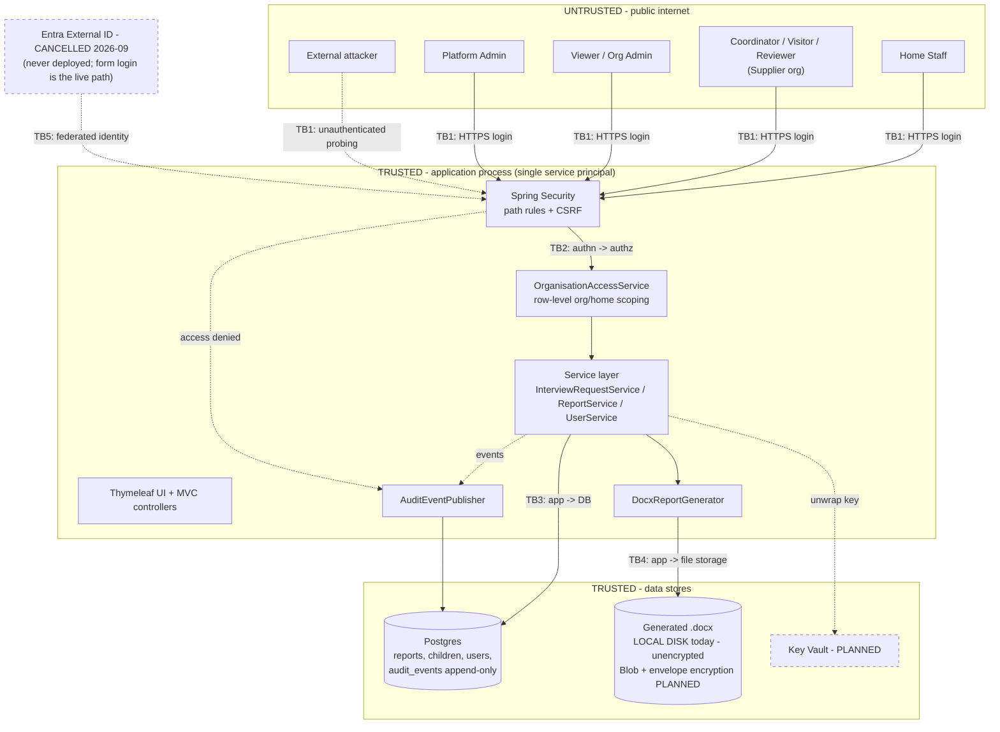

# Threat Model — return-home-tracker

- **Status:** Analysis. Read-only synthesis; no code changed.
- **Date:** 2026-08-30
- **Sources:** `BUG-REVIEW.md`, `AUTH-PROVIDER-OPTIONS.md`, `AUDIT-PLAN.md`,
  `DOCUMENT-ENCRYPTION-DESIGN.md`, `ARCHITECTURE.md`, and the code as it stands at commit `b1126c4`.
- **Method:** STRIDE per element, with mitigations verified against the working tree rather than
  assumed from plan documents.

> ## ⚠️ REVISION 2026-09-09 (T242) — AUTHENTICATION SECTIONS ONLY
>
> **The analysis below was written on 2026-08-30 against commit `b1126c4`, when the plan was to move
> to a managed identity provider. That plan was cancelled.** Entra External ID was removed; **form
> login is now the only way into the system and is what the pilot ships on.**
>
> **This revision updates the authentication rows ONLY** — §5.1, R1, R2, R12, and the §8 auth
> recommendations. **Everything else (R3–R11, §5.2–§5.5) is untouched and still carries its
> 2026-08-30 status**, which means those rows are of unknown currency, not verified-as-current. Say
> so rather than let a partial refresh imply a whole one.
>
> **Where a remediation was cancelled it is marked CANCELLED rather than quietly replaced**, so a
> reader who knew the old plan can see it was withdrawn instead of finding different text and
> assuming they misremembered.
>
> **Companion document:** `shared-handoff/FORM-LOGIN-HARDENING-AND-MFA-PLAN.md` holds the current
> auth design, the disclosure-equality principle, and the outstanding hardening list. **Where the two
> could disagree, that document is authoritative on the auth posture and this one defers to it.**

> **Verification note — please read.** Mitigation status below was checked against the code, not
> taken from the roadmap. Two items previously reported as shipped are **not**: credentials are
> still committed in plaintext, and there is still no login throttling. Conversely, the audit trail
> and reviewer read-only **are** shipped. The gap between plan and reality is itself a finding.

## 1. System overview and data classification

A multi-tenant Spring Boot / Thymeleaf application that manages **return-home interviews** for
children who have gone missing from care. Two organisation types (`OrgType`): **Care Providers**
(who run children's homes) and **Suppliers** (who conduct interviews on their behalf). Seven
composable roles (`Role`). Workflow: Home Staff raise a request → Coordinator allocates a Visitor →
Visitor interviews the child and writes a report → Reviewer approves/rejects → an approved report
is rendered to a signed .docx.

**Data classification: the highest tier this organisation handles.** Interview reports contain a
named child's account of why they went missing, where they were, who they were with, safeguarding
concerns, and risk assessments. Under UK GDPR this is **special-category personal data (Art. 9)**
concerning **children**, in a **statutory safeguarding** context. A breach is not a privacy
inconvenience — it can place a child at physical risk (e.g. `infoToHelpLocateFuture`,
`whoWereYouWithWhileMissing` would be directly useful to someone seeking to locate or exploit that
child). This classification drives every severity judgement below.

## 2. Assets

| # | Asset | Where it lives | Why it matters |
|---|---|---|---|
| A1 | **Interview report content** | `interview_reports` (Postgres); rendered .docx | Special-category child data; the crown jewels |
| A2 | **Interview requests / missing-episode data** | `interview_requests` | `missingSince`, `knownRisks`, `legalStatus` — safeguarding-sensitive |
| A3 | **Child identity records** | `children` | Names, DOB, home, case reference |
| A4 | **Generated .docx files** | **Local disk today**; Azure Blob per `ARCHITECTURE.md` | A1 in portable, exfiltratable form |
| A5 | **Audit log** | `audit_events` (append-only) | Evidential record; its integrity is the repudiation defence |
| A6 | **Credentials & secrets** | `application.properties` (**in git**), later Key Vault | DB creds + admin bootstrap password |
| A7 | **Encryption keys** | Key Vault (designed, not built) | Would gate A4 at rest |
| A8 | **Session cookies** | Browser + server | Session hijack = full impersonation |
| A9 | **User & role assignments** | `users`, `user_roles`, `user_viewer_homes` | Tampering here escalates privilege |

## 3. Trust boundaries and data flow

**Boundaries.** *TB1* internet → app (the main attack surface). *TB2* authenticated → authorised —
**the multi-tenancy boundary, enforced only in application code**. *TB3* app → database. *TB4* app →
file storage (weakest today: plaintext files on local disk). *TB5* app → external IdP (planned).

## 4. Threat actors

| Actor | Capability | Motivation | Primary concern |
|---|---|---|---|
| **TA1 External attacker** | Unauthenticated network access; can enumerate, guess credentials, probe endpoints | Data theft, extortion, notoriety | The seeded `admin`/`ChangeMe123!` account (§7 R1) |
| **TA2 Malicious/compromised org user** | Valid credentials for *one* organisation | Cross-tenant curiosity, or acting for a third party seeking a child | Breaking the TB2 tenancy boundary |
| **TA3 Curious insider (legitimate staff)** | Valid access to their own scope | Personal curiosity about a known child | Excessive-but-authorised access; only detectable via A5 |
| **TA4 Platform/cloud insider** | Infrastructure-level access | Rare; legal compulsion or rogue operator | Plaintext data at rest |
| **TA5 Compromised application** | Everything the app can do | Pivot from RCE or stolen deploy credentials | Unbounded — see §7 R9 |
| **TA6 Lost/stolen device** | An authenticated live session | Opportunistic | Session lifetime, no MFA |

## 5. STRIDE analysis

### 5.1 Authentication / session (TB1, TB5)

> **The mechanism under assessment, stated because this document did not previously name it.**
> Authentication is **our own form login**: username and password in our database, BCrypt-hashed,
> with per-username failed-attempt throttling and a timed lockout. **There is no second factor and no
> external identity provider.** Sign-in is `POST /login`; the lockout is enforced ahead of the
> authentication provider (T221) and its message is selected without reference to whether the account
> exists (T215).
>
> **Two properties of the deployment shape the rows below and are easy to miss:** the app runs on
> **shared devices in care homes, out of hours**, and **`username` — not email — is the login key**,
> which is why a shared mailbox does not by itself defeat sign-in but would defeat any second factor
> delivered to it. Both are developed in `FORM-LOGIN-HARDENING-AND-MFA-PLAN.md`.

| STRIDE | Threat | Status |
|---|---|---|
| **S** | Brute-force or credential-stuff the known `admin` account | **Partly mitigated (2026-09)** — throttling + lockout shipped (T22); **MFA still absent and now unowned, see R2** |
| **S** | Session hijack via stolen cookie (TA6) | Partly mitigated — HTTPS + `HttpOnly` defaults; no re-auth for sensitive actions |
| **T** | CSRF forcing a state change (approve, create user) | **Mitigated** — Spring Security CSRF is on (not disabled anywhere) |
| **R** | User denies logging in | **Mitigated** — `LOGIN_SUCCESS` / `LOGIN_FAILURE` audited |
| **I** | Username enumeration via differential login errors | **Mitigated (T215)** — the lockout page renders identically for a real and an unknown account, asserted in `LoginLockoutIntegrationTest`. See the disclosure-equality principle in FLOOR-RULES.md: the rule is about CHANNELS, not response text |
| **D** | Login flooding | **Partly mitigated** — per-username throttling shipped, but it is **username-keyed, so it structurally cannot see password SPRAYING** (one password across many accounts raises no single counter). Detection, not prevention, is the answer: alert on cross-account failure volume |
| **E** | Password-only path to full platform ADMIN | **OPEN — and the condition this row used to carry is unreachable.** It read *"OPEN until Entra + MFA lands"*; **Entra was cancelled and will never land, so the row was permanently open by construction while reading as SCHEDULED** — which is worse than reading as open, because a row that looks like it has a plan is skipped by the reader who would otherwise act. **No owner. See R2.** |

### 5.2 Authorisation / multi-tenancy (TB2) — the critical boundary

| STRIDE | Threat | Status |
|---|---|---|
| **E** | A Care-Provider user reads another provider's children/reports | **Mitigated** — `OrganisationAccessService.canViewCareProviderOrg/canViewHome`, applied in `getAuthorized` on every entity path |
| **E** | A Supplier user reaches a Care Provider they are not assigned to | **Mitigated** — supplier link resolved via `findSupplierOrganisationIdByCareProviderId` |
| **E** | IDOR: guessing `/interview-requests/{id}` | **Mitigated** — every read goes through `getAuthorized`, not the URL alone |
| **E** | Reviewer approves their own report (conflict of interest) | **Mitigated** — explicit self-review check in `getReviewable` |
| **E** | Org-admin assigns themselves a role they shouldn't hold | **Mitigated** — `UserService.validateRoles` + `allowedRolesFor` |
| **T** | **Visitor fabricates or overwrites a report at any workflow stage, including after approval** — `existingOrNewReport` checks *who* but never `request.getStatus()`; only the UI hint gates it | **OPEN — BUG-REVIEW #2 (R3)** |
| **E** | Care-Provider org linked to a "supplier" that isn't SUPPLIER-type, widening visibility | **OPEN per BUG-REVIEW #3 (R7)** — re-verify before closing |
| **E** | Defence-in-depth gap: `CoordinatorController` repository helper trusts the caller's role | **OPEN — BUG-REVIEW #8** |

### 5.3 Report data and documents (A1, A4 — TB4)

| STRIDE | Threat | Status |
|---|---|---|
| **I** | Anyone with filesystem/storage access reads plaintext .docx | **OPEN (R4)** — local disk, unencrypted; envelope encryption is *designed only* |
| **I** | Stolen backup / copied prod files (TA4) | **OPEN (R4)** — same root cause |
| **T** | Reviewer alters the visitor's words but the docx signs it in the visitor's name | **MITIGATED (was T30)** — reviewer view is read-only (`fields(true)`) and `approve()` no longer applies form values |
| **T** | Concurrent edits silently clobber each other | **OPEN — BUG-REVIEW #7 (R8)**, no `@Version` anywhere |
| **I** | Response-header injection / broken downloads via unsanitised child name in `Content-Disposition` | **OPEN — BUG-REVIEW #4 (R6)** |
| **R** | Dispute over who generated or downloaded a report | **Mitigated** — `DOCX_GENERATED` / `DOCX_DOWNLOADED` audited |
| **I** | Approved reports visible pre-approval | **Mitigated** — `approvedReportFor` enforces APPROVED |

### 5.4 Audit log (A5)

| STRIDE | Threat | Status |
|---|---|---|
| **T** | Attacker edits/deletes audit rows to cover tracks | **Strongly mitigated** — DB trigger raises on UPDATE/DELETE; fails loudly, not silently |
| **R** | Actor deleted, so their trail becomes unreadable | **Mitigated** — denormalised `actor_username_at_time` / `actor_roles_at_time` |
| **I** | Audit log becomes a second copy of child data | **Mitigated by design** — `metadata` holds ids and transitions only (AUDIT-PLAN §B.5) |
| **D** | Audit write failure blocks business operations | Review: confirm the listener's failure mode is deliberate |
| — | **Nobody is watching the log** | **OPEN (R5)** — no alerting or monitoring |

### 5.5 Infrastructure and supply chain (TB3, TB4)

| STRIDE | Threat | Status |
|---|---|---|
| **I** | DB credentials in source control | **OPEN — R1**, `application.properties` in git |
| **I** | SQL injection | **Mitigated** — JPA/Spring Data parameterised throughout |
| **E** | Compromised app unwraps every org's keys | **ACCEPTED** — inherent to one service principal (`DOCUMENT-ENCRYPTION-DESIGN` §3) |
| **I** | Identity data resident in EMEA rather than UK-only | **ACCEPTED** — `AUTH-PROVIDER-OPTIONS` §5; app data stays UK South |
| **D** | No rate limiting anywhere; docx generation is CPU/memory-heavy | **OPEN**, low likelihood at 20 users |
| **T** | Vulnerable dependency (POI, Spring, Postgres driver) | **OPEN (R10)** — no CI, no dependency scanning, no patch cadence |

## 6. Mitigations — verified against the code

**Shipped and confirmed:**
- **Two-layer authorisation** — `SecurityConfig` path rules + `OrganisationAccessService` row-scoping through `getAuthorized`. This is the strongest part of the system and is applied consistently.
- **Audit trail phase 1** — `V11__add_audit_events.sql` with an append-only plpgsql trigger; `audit` package with 14 event types including `LOGIN_SUCCESS/FAILURE`, `ACCESS_DENIED`, `DOCX_GENERATED/DOWNLOADED`; org/home stamped per AUDIT-PLAN §B.3; no report content stored.
- **Reviewer read-only** — closes the docx signature-authorship threat (T30).
- **CSRF protection** — Spring Security default, never disabled.
- **BCrypt** password hashing.
- **Conflict-of-interest and workflow guards** — self-review block; `confirmSchedule` status check.
- **`open-in-view=false`, `ddl-auto=validate`** — sound persistence hygiene.

**Designed but NOT built (as of 2026-08-30):** ~~Entra External ID + MFA~~ — **CANCELLED**; envelope encryption for .docx; Blob storage; Key Vault; observability/Actuator; CI. **Only the Entra clause was re-checked for this revision — the currency of the rest is unknown, not confirmed.**

**NOT shipped despite being reported as shipped:** credentials externalisation, login throttling.

## 7. Gaps and residual risks, prioritised

| ID | Risk | Sev | Actor | Status |
|---|---|---|---|---|
| **R1** | Seeded admin + DB creds committed in git | **Critical** | TA1 | **CLOSED (T22)** — credentials externalised to the environment; `AdminUserSeeder` **fails closed**, skipping loudly rather than falling back to a baked-in password. Verified in the working tree |
| **R2** | No login throttling/lockout/**MFA** | **High** | TA1 | **HALF CLOSED, AND THE OPEN HALF HAS NO OWNER.** Throttling + lockout shipped (T22/T215/T221). **The MFA half's only remediation was the Entra migration — CANCELLED, not replaced.** A plan for our own MFA (TOTP recommended) is in `FORM-LOGIN-HARDENING-AND-MFA-PLAN.md` part 3; **it is a plan, not a commitment, and nobody is building it** |
| **R3** | **Report fabrication/overwrite at any stage** — no status check in `existingOrNewReport`; a report can be submitted for a visit that never happened, or overwritten post-approval | **High** | TA2 | Open (BUG-REVIEW #2) |
| **R4** | **Generated .docx unencrypted on local disk** — plaintext special-category data outside the DB | **High** | TA4 | Open; design exists |
| **R5** | **No monitoring/alerting** — we now record attacks in `audit_events` but nobody is watching. Detection gap, not prevention | **High** | all | Open |
| **R6** | Unsanitised child name in `Content-Disposition` — header injection / broken downloads | **Medium** | TA2 | Open (BUG-REVIEW #4) |
| **R7** | Supplier-link type not validated — could widen cross-org visibility | **Medium** | TA2 | Open (BUG-REVIEW #3) |
| **R8** | No optimistic locking — concurrent actions silently clobber safeguarding records | **Medium** | — | Open (BUG-REVIEW #7) |
| **R9** | Compromised app can decrypt all orgs | **Medium** | TA5 | **Accepted** — inherent to the architecture |
| **R10** | No CI, dependency scanning or patch cadence | **Medium** | TA1 | Open |
| **R11** | Org-admins cannot save edits to ORG_ADMIN users | **Low** (availability) | — | Open (BUG-REVIEW #5) |
| **R12** | Entra identity data in EMEA, not UK-only | — | — | **NO LONGER APPLICABLE (2026-09)** — Entra was never deployed, so no identity data ever left the UK by this route. **The accepted risk is void rather than mitigated:** it lapsed because the system was cancelled, not because anything was done about it |

**Honest summary.** The **authorisation model is genuinely good** — cross-tenant isolation is
carefully implemented and consistently applied, and the audit trail is well built. The exposure is
almost entirely at the **edges**: getting in (R1, R2), workflow integrity once in (R3), data at rest
(R4), and noticing any of it (R5). R1 is the one that would turn a good design into a serious
breach, and it is a configuration fix, not an architectural one.

## 8. Prioritised recommendations

**Already decided / in flight** — continue as planned:

| Rank | Action | Addresses | Effort |
|---|---|---|---|
| ~~1~~ | ~~Entra External ID migration + MFA for ADMIN/ORG_ADMIN~~ — **CANCELLED 2026-09. This was the #1 ranked security action in this document and it will not happen.** It is struck rather than deleted so the withdrawal is visible. **Its MFA half is a real, unowned gap** — see R2 | R2 | — |
| 2 | Blob migration **with envelope encryption applied at the move** (not retrofitted) | R4 | M |
| 3 | Observability (Actuator, structured logs, App Insights) + **alerting on the audit stream** | R5 | M |
| 4 | Audit phase 2 + `/admin/audit` screen | TA3 detection | S–M |

**New / not yet scheduled** — ranked by risk reduction per unit effort:

| Rank | Action | Addresses | Effort |
|---|---|---|---|
| **1** | **Fail startup if `app.admin.password` is unset or still the placeholder outside a dev profile; move DB creds to env/Key Vault; rotate what is in git history** | **R1** | **S — do first** |
| **2** | **Add the missing status check to `existingOrNewReport`** (mirror `confirmSchedule`) | R3 | **S** |
| ~~3~~ | ~~Interim login throttling, *"ahead of Entra"*~~ — **SHIPPED (T22).** The word *interim* is void: there is no successor scheme, so this is now **the** throttling, permanently, and should be assessed as a destination rather than a stopgap | R2 | Done |
| 4 | Sanitise/RFC 6266-encode the `Content-Disposition` filename | R6 | S |
| 5 | CI running the existing test suite + dependency scanning | R10 | S |
| 6 | Validate the supplier link is a SUPPLIER-type org | R7 | S |
| 7 | `@Version` on `InterviewRequest`/`InterviewReport` | R8 | S |
| 8 | Role check in the `CoordinatorController` helper (defence in depth) | 5.2 | S |

Items 1–2 are hours of work against Critical/High risks and should precede any further feature
work.

## 9. Decisions for the human

1. **Confirm R1 is treated as an incident, not a backlog item.** If any environment has ever run
   with the default admin password, the account should be assumed compromised: rotate it, rotate
   the DB credentials, purge them from git history, and review `audit_events` for `LOGIN_SUCCESS`
   as `admin`. This is the single most urgent item in this document.
2. **Accept or reject the detection gap (R5) in the interim.** Until alerting exists we can
   *reconstruct* an incident afterwards but cannot *notice* one. If that is not acceptable for
   safeguarding data, R5 should be promoted above some feature work.
3. **Confirm the retention/monitoring owner.** The audit trail is only an assurance control if a
   named person reviews it; nobody currently owns that.
